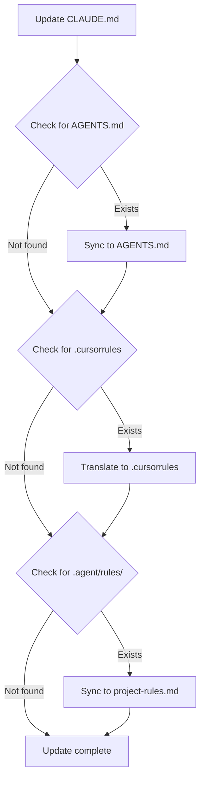

# Platform-Specific Memory File Formats

This reference documents the differences between memory files across different AI coding platforms.

---

## Overview

| Platform | Primary File | Format | Sync Strategy |
|----------|-------------|--------|---------------|
| Claude Code | `CLAUDE.md` | Markdown | Source of truth |
| Codex | `AGENTS.md` | Markdown | Identical content |
| Cursor | `.cursorrules` | Cursor-specific | Format translation |
| Gemini (Antigravity) | `.agent/rules/project-rules.md` | Markdown | Content + prefix |
| Generic | `.agentrules` | Markdown | Identical content |

---

## CLAUDE.md (Claude Code)

**Location**: Project root or `~/CLAUDE.md`

**Format**: Standard Markdown with sections

**Structure**:
```markdown
# Project Name

## Section 1: Core Rules
[Content...]

## Section 2: Workflows
[Content...]

## Section 3: Architecture
[Content...]

## 📚 Related Documentation
- [Link to specialized docs]

---

*Last updated: YYYY-MM-DD*
```

**Tool References**:
- Use `.claude/` for Claude-specific paths
- Skills: `/skill-name`
- Plugins: References to Claude plugins

---

## AGENTS.md (Codex)

**Location**: Project root or `~/AGENTS.md`

**Format**: Identical to CLAUDE.md except:

**Differences**:
1. Tool paths: `.codex_cache/` instead of `.claude/`
2. Command format: Same skill names work
3. Header note: Add compatibility note at top

**Example Header**:
```markdown
# Project Name

> This is the Codex-compatible version. Source of truth: CLAUDE.md

## Section 1: Core Rules
[Identical content to CLAUDE.md...]
```

**Sync Strategy**: Mirror CLAUDE.md exactly, only change tool paths

---

## .cursorrules (Cursor)

**Location**: Project root or `~/.cursorrules`

**Format**: Cursor-specific syntax (can be markdown-like)

**Structure**:
```
# Project Rules for Cursor

## Rules
- Rule 1
- Rule 2

## Context
[Project-specific context]

## Commands
- Command descriptions
```

**Differences from CLAUDE.md**:
1. More concise format
2. Bullet-point heavy
3. Less structured sections
4. Cursor-specific features (e.g., `@workspace` references)

**Translation Strategy**:
- Extract core rules from CLAUDE.md
- Simplify to bullet points
- Remove Claude-specific references
- Add Cursor-specific features if needed

---

## .agent/rules/project-rules.md (Gemini/Antigravity)

**Location**: `.agent/rules/project-rules.md`

**Format**: Markdown with Gemini compatibility prefix

**Structure**:
```markdown
# Project Rules (Gemini Compatible)

> This file is synced with CLAUDE.md and AGENTS.md
> Gemini-specific paths use `.agent/` directory structure

## Section 1: Core Rules
[Identical content to CLAUDE.md...]

## Gemini-Specific Notes
- Uses `.agent/rules/` for specialized docs
- Uses `.agent/tmp/` for temporary files
- Uses `.agent/scripts/` for automation

[Rest of content identical to CLAUDE.md]
```

**Sync Strategy**: Full sync + add Gemini-specific section

---

## .agentrules (Generic)

**Location**: Project root or `~/.agentrules`

**Format**: Generic markdown, platform-agnostic

**Structure**:
```markdown
# Project Rules

[Content from CLAUDE.md without platform-specific references]
```

**Sync Strategy**: Remove all platform-specific references

---

## Specialized Documentation

### .agent/rules/*.md

**Location**: `.agent/rules/` directory

**Purpose**: Domain-specific rules (API patterns, workflows, troubleshooting)

**Common Files**:
- `api-patterns.md` - API authentication, rate limiting, error handling
- `workflow-architecture.md` - Workflow state machines, error recovery
- `troubleshooting.md` - Common errors and solutions
- `design-checklists.md` - Design verification steps
- `cognitive-patterns.md` - Meta-learning and cognitive awareness

**Format**: Compact markdown following LLM-friendly constraints

---

## Sync Translation Rules

### Content Sync

| Source Section | AGENTS.md | .cursorrules | .agent/rules/ | .agentrules |
|----------------|-----------|--------------|---------------|-------------|
| Core Rules | ✅ Identical | ⚡ Simplified | ✅ Identical | ✅ Identical |
| Workflows | ✅ Identical | ⚡ Simplified | ✅ Identical | ✅ Identical |
| Architecture | ✅ Identical | ⚡ Simplified | ✅ Identical | ✅ Identical |
| Tool Paths | 🔄 Translate | ❌ Remove | 🔄 Translate | ❌ Remove |
| Platform Notes | ✅ Add Codex note | ❌ Skip | ✅ Add Gemini note | ❌ Skip |

**Legend**:
- ✅ Keep identical
- 🔄 Translate/adjust
- ⚡ Simplify format
- ❌ Remove/skip

### Path Translation

| CLAUDE.md | AGENTS.md | .agent/rules/ |
|-----------|-----------|---------------|
| `.claude/skills/` | `.codex_cache/skills/` | `.agent/rules/` |
| `.claude/plugins/` | `.codex_cache/plugins/` | `.agent/scripts/` |
| `/tmp/claude/` | `/tmp/codex/` | `.agent/tmp/` |

### Command Translation

| CLAUDE.md | AGENTS.md | .cursorrules | Notes |
|-----------|-----------|--------------|-------|
| `/learn` | `/learn` | Same | Skills work across platforms |
| `/commit` | `/commit` | Same | Standard skill names |
| `@claude` | `@codex` | `@cursor` | Platform-specific mentions |

---

## Sync Workflow

### Step-by-Step Process



### Verification Checklist

After sync, verify:
- [ ] Core content identical across primary files
- [ ] Tool paths correctly translated
- [ ] Platform-specific notes added
- [ ] Navigation updated in all primary files
- [ ] No syntax errors introduced
- [ ] File permissions preserved

---

## Format Examples

### CLAUDE.md Format

```markdown
## Rule: API Authentication

Pattern: Bearer token in Authorization header
- Check: `Authorization: Bearer <token>` present
- Miss: Forgetting header in new endpoints
- Test: `curl -H "Authorization: Bearer test_token"`
- Ref: .claude/rules/api-patterns.md#auth
```

### AGENTS.md Format (Identical)

```markdown
## Rule: API Authentication

Pattern: Bearer token in Authorization header
- Check: `Authorization: Bearer <token>` present
- Miss: Forgetting header in new endpoints
- Test: `curl -H "Authorization: Bearer test_token"`
- Ref: .codex_cache/rules/api-patterns.md#auth
```

### .cursorrules Format (Simplified)

```
API Authentication
- Always include: Authorization: Bearer <token>
- Test: curl -H "Authorization: Bearer test_token"
```

### .agent/rules/project-rules.md Format

```markdown
## Rule: API Authentication

Pattern: Bearer token in Authorization header
- Check: `Authorization: Bearer <token>` present
- Miss: Forgetting header in new endpoints
- Test: `curl -H "Authorization: Bearer test_token"`
- Ref: .agent/rules/api-patterns.md#auth

Note: For Gemini, see .agent/rules/api-patterns.md for detailed examples
```

---

## Best Practices

### When Creating New Content

1. **Always start with CLAUDE.md** as source of truth
2. **Use platform-agnostic language** when possible
3. **Add platform-specific sections** only when necessary
4. **Test sync** before committing

### When Updating Existing Content

1. **Update CLAUDE.md first**
2. **Run sync process** to update other files
3. **Verify consistency** across all files
4. **Check navigation links** still work

### When Platform-Specific Features Needed

1. **Document in primary file** with platform note
2. **Create specialized doc** if feature is complex
3. **Add cross-references** between files
4. **Update navigation** in all primary files

---

## Troubleshooting

### Common Issues

**Issue**: Sync failed between CLAUDE.md and AGENTS.md
**Solution**: Check file permissions, ensure files exist, verify no syntax errors

**Issue**: .cursorrules not applying changes
**Solution**: Cursor may cache rules, restart Cursor IDE

**Issue**: Path references broken after sync
**Solution**: Verify path translation rules applied correctly

**Issue**: Navigation links inconsistent
**Solution**: Re-run navigation update for all primary files

---

## Tools

### Scripts

- `discover-memory-files.sh` - Finds all memory files
- `sync-memory-files.sh` - (TODO) Automates sync process
- `validate-sync.sh` - (TODO) Validates consistency

### Manual Sync Commands

```bash
# Discover all memory files
~/.claude/skills/learn/scripts/discover-memory-files.sh

# Manual sync (example)
cp CLAUDE.md AGENTS.md
# Then manually adjust tool paths

# Validate
diff -u CLAUDE.md AGENTS.md | grep -E "^\+|^\-" | grep -v "^+++\|^---"
```

---

## References

- [Claude Code Documentation](https://code.claude.com/docs)
- [Cursor Rules Guide](https://cursor.sh/docs)
- [Codex Documentation](https://developers.openai.com/codex)
- [Gemini Antigravity Docs](https://gemini.google.com/docs)

---

*Last updated: 2026-01-18*
